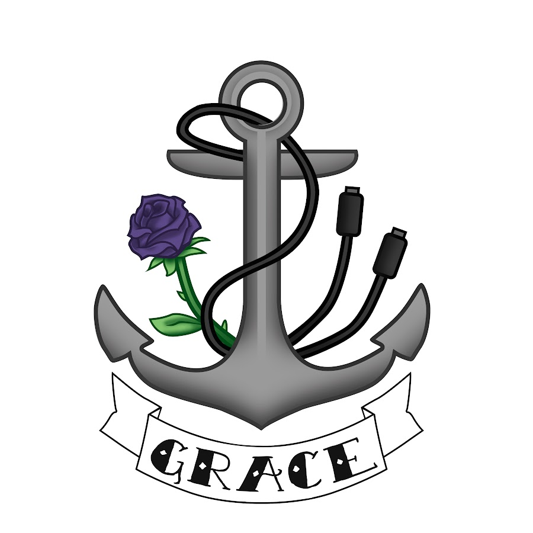

# 📚 Guia de Migração: HTML → React/Next.js

## 🎯 Visão Geral da Migração

Este documento detalha como o site GRACE foi migrado de HTML/CSS/JavaScript puro para React/Next.js.

## 📊 Comparação Técnica

### Arquitetura

| Aspecto | HTML/CSS/JS | React/Next.js |
|---------|-------------|---------------|
| **Estrutura** | Múltiplos arquivos HTML | Componentes React reutilizáveis |
| **Roteamento** | Links diretos (.html) | Next.js App Router |
| **Estilos** | CSS global + Bootstrap | Tailwind CSS + CSS Modules |
| **JavaScript** | Vanilla JS | TypeScript + React |
| **Build** | Nenhum | Next.js otimizado |
| **SEO** | Meta tags estáticas | Metadata dinâmica + SSR |

## 🔄 Mapeamento de Arquivos

### Páginas HTML → Rotas Next.js

```
HTML (Antes)                    →  Next.js (Depois)
─────────────────────────────────────────────────────────
index.html                      →  app/page.tsx
equipe.html                     →  app/equipe/page.tsx
robotica-escola.html            →  app/robotica-escola/page.tsx
escola-web.html                 →  app/escola-web/page.tsx
ciencia-dados.html              →  app/ciencia-dados/page.tsx
pensamento-computacional.html   →  app/pensamento-computacional/page.tsx
materiais.html                  →  app/materiais/page.tsx (a criar)
```

### Componentes Extraídos

```
HTML Repetido                   →  Componente React
─────────────────────────────────────────────────────────
<header> (em todas páginas)     →  components/Header.tsx
<footer> (em todas páginas)     →  components/Footer.tsx
Hero carousel                   →  components/Hero.tsx
```

## 🛠️ Mudanças Principais

### 1. Header/Navegação

**Antes (HTML):**
```html
<!-- Repetido em TODAS as páginas -->
<header id="header" class="header d-flex align-items-center fixed-top">
  <div class="container-fluid">
    <a href="index.html" class="logo">
      
    </a>
    <nav id="navmenu" class="navmenu">
      <ul>
        <li><a href="#hero">HOME</a></li>
        <!-- ... mais itens ... -->
      </ul>
    </nav>
  </div>
</header>
```

**Depois (React):**
```tsx
// components/Header.tsx - Usado uma vez, aparece em todas as páginas
export default function Header() {
  return (
    <header className="fixed top-0 left-0 right-0 z-50">
      <div className="container mx-auto">
        <Link href="/">
          <Image src="/assets/img/grace-logo.jpg" alt="GRACE Logo" />
        </Link>
        <nav>
          <Link href="/#hero">HOME</Link>
          {/* ... mais itens ... */}
        </nav>
      </div>
    </header>
  );
}
```

### 2. Roteamento

**Antes:**
```html
<a href="equipe.html">Equipe</a>
<a href="robotica-escola.html">Robótica</a>
```

**Depois:**
```tsx
<Link href="/equipe">Equipe</Link>
<Link href="/robotica-escola">Robótica</Link>
```

### 3. Estilos

**Antes (CSS):**
```css
/* assets/css/main.css */
.hero {
  background: linear-gradient(135deg, #5b2a86 0%, #ff006e 100%);
  padding: 100px 0;
}

.card {
  background: white;
  border-radius: 16px;
  padding: 30px;
  box-shadow: 0 4px 20px rgba(0,0,0,0.08);
}
```

**Depois (Tailwind):**
```tsx
<section className="bg-gradient-to-br from-purple-900 to-pink-600 py-24">
  <div className="bg-white rounded-2xl p-8 shadow-lg">
    {/* conteúdo */}
  </div>
</section>
```

### 4. Animações

**Antes (JavaScript):**
```javascript
// assets/js/main.js
document.addEventListener('scroll', function() {
  const elements = document.querySelectorAll('.animate-on-scroll');
  elements.forEach(el => {
    if (isInViewport(el)) {
      el.classList.add('animated');
    }
  });
});
```

**Depois (Framer Motion):**
```tsx
<motion.div
  initial={{ opacity: 0, y: 30 }}
  whileInView={{ opacity: 1, y: 0 }}
  transition={{ duration: 0.6 }}
  viewport={{ once: true }}
>
  {/* conteúdo */}
</motion.div>
```

### 5. Imagens

**Antes:**
```html

```

**Depois (Otimizado):**
```tsx
<Image
  src="/assets/img/grace-logo.jpg"
  alt="GRACE Logo"
  width={120}
  height={60}
  className="h-12 w-auto"
/>
```

## 📈 Benefícios da Migração

### Performance
- ✅ **Code Splitting**: Carrega apenas o necessário
- ✅ **Image Optimization**: Imagens otimizadas automaticamente
- ✅ **Lazy Loading**: Componentes carregados sob demanda
- ✅ **Caching**: Melhor cache de recursos

### Manutenibilidade
- ✅ **DRY**: Sem código duplicado
- ✅ **Componentização**: Fácil reutilização
- ✅ **TypeScript**: Menos bugs, melhor autocomplete
- ✅ **Hot Reload**: Desenvolvimento mais rápido

### SEO
- ✅ **SSR**: Server-Side Rendering
- ✅ **Metadata**: Gerenciamento centralizado
- ✅ **Sitemap**: Geração automática
- ✅ **Performance**: Melhor ranking no Google

### Developer Experience
- ✅ **TypeScript**: Tipagem estática
- ✅ **ESLint**: Código consistente
- ✅ **Git**: Melhor controle de versão
- ✅ **Deploy**: CI/CD simplificado

## 🔧 Configurações Importantes

### next.config.js
```javascript
/** @type {import('next').NextConfig} */
const nextConfig = {
  images: {
    domains: ['grace.icmc.usp.br'],
  },
  // Outras configurações...
}

module.exports = nextConfig
```

### tailwind.config.ts
```typescript
import type { Config } from "tailwindcss";

const config: Config = {
  content: [
    "./pages/**/*.{js,ts,jsx,tsx,mdx}",
    "./components/**/*.{js,ts,jsx,tsx,mdx}",
    "./app/**/*.{js,ts,jsx,tsx,mdx}",
  ],
  theme: {
    extend: {
      colors: {
        primary: '#ff006e',
        secondary: '#8338ec',
      },
    },
  },
  plugins: [],
};
export default config;
```

## 📝 Checklist de Migração

### ✅ Concluído
- [x] Estrutura base do projeto Next.js
- [x] Componentes globais (Header, Footer, Hero)
- [x] Página inicial completa
- [x] Página da equipe com filtros
- [x] Páginas de ações (4 projetos)
- [x] Estilos com Tailwind CSS
- [x] Animações com Framer Motion
- [x] Otimização de imagens
- [x] SEO metadata
- [x] Responsividade mobile
- [x] Navegação funcional
- [x] Assets copiados

### 🔄 Pendente (Opcional)
- [ ] Página de Materiais
- [ ] Sistema de blog
- [ ] Formulário de contato com backend
- [ ] Galeria de fotos
- [ ] Sistema de newsletter
- [ ] Modo escuro
- [ ] Testes automatizados
- [ ] Internacionalização (i18n)

## 🚀 Como Continuar

### Adicionar Nova Página

1. Crie o diretório e arquivo:
```bash
mkdir app/nova-pagina
touch app/nova-pagina/page.tsx
```

2. Estrutura básica:
```tsx
export default function NovaPaginaPage() {
  return (
    <>
      <section className="pt-32 pb-20 bg-gradient-to-br from-purple-600 to-pink-600">
        <div className="container mx-auto px-4">
          <h1 className="text-5xl font-bold text-white">Nova Página</h1>
        </div>
      </section>
      {/* Mais seções... */}
    </>
  );
}
```

3. Adicione ao Header:
```tsx
<Link href="/nova-pagina">Nova Página</Link>
```

### Adicionar Novo Componente

1. Crie o arquivo:
```bash
touch components/NovoComponente.tsx
```

2. Implemente:
```tsx
export default function NovoComponente() {
  return (
    <div className="card">
      {/* conteúdo */}
    </div>
  );
}
```

3. Use onde necessário:
```tsx
import NovoComponente from '@/components/NovoComponente';

<NovoComponente />
```

## 📚 Recursos Úteis

- [Next.js Documentation](https://nextjs.org/docs)
- [React Documentation](https://react.dev)
- [Tailwind CSS](https://tailwindcss.com/docs)
- [Framer Motion](https://www.framer.com/motion/)
- [TypeScript Handbook](https://www.typescriptlang.org/docs/)

## 🤔 FAQ

**Q: Por que Next.js ao invés de React puro?**
A: Next.js oferece SSR, otimização automática, roteamento file-based e melhor SEO out-of-the-box.

**Q: Posso usar CSS tradicional?**
A: Sim! Mas Tailwind oferece desenvolvimento mais rápido e consistente.

**Q: Como faço deploy?**
A: Recomendamos Vercel (criadores do Next.js) para deploy com um clique.

**Q: E o código antigo?**
A: Mantenha o diretório original como backup. O novo projeto é independente.

---

**Migração realizada com sucesso! 🎉**